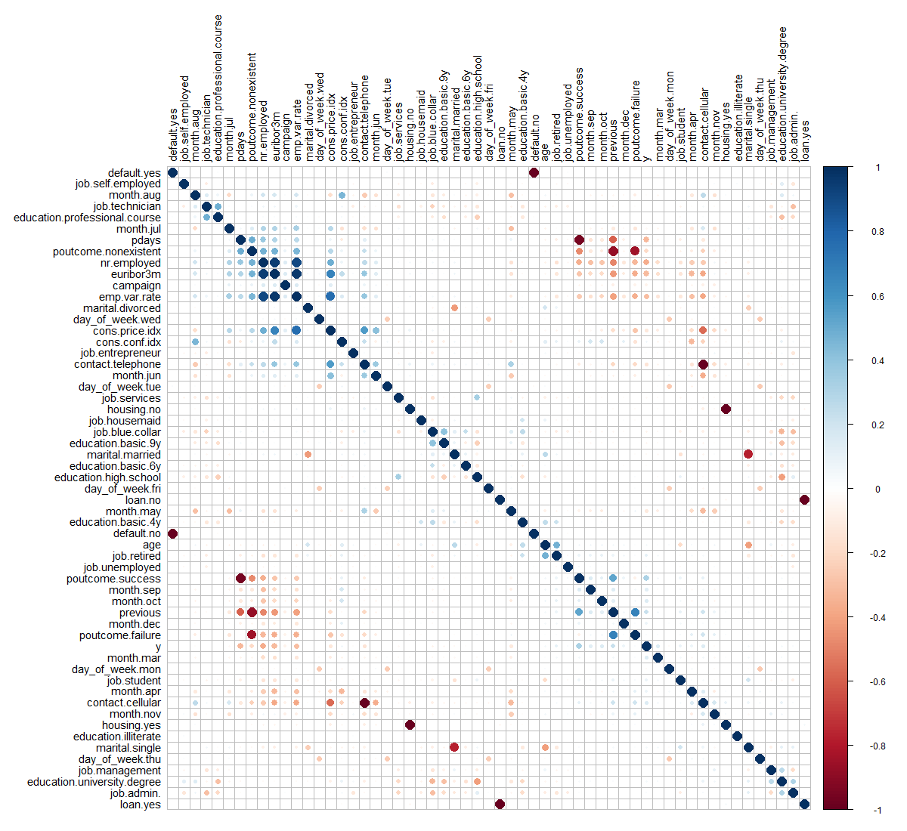
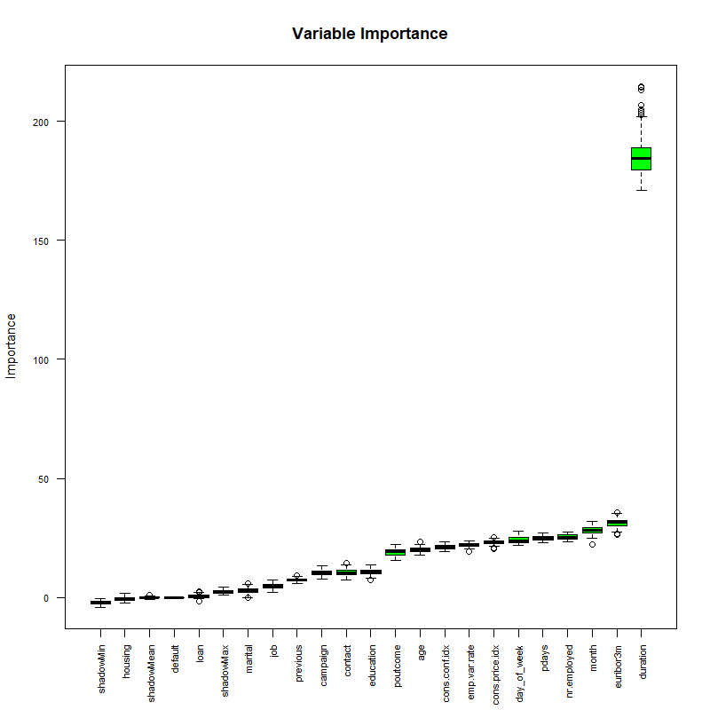
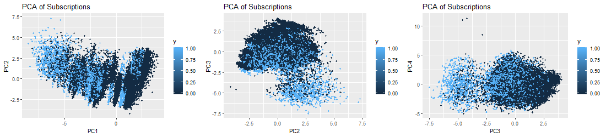
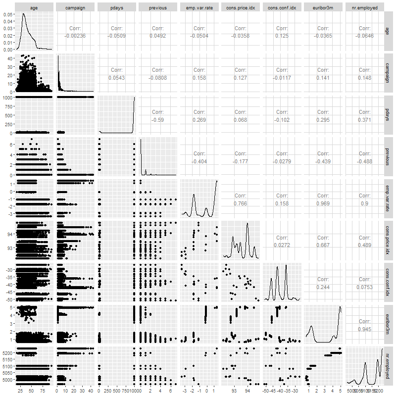

```{r setup, include=FALSE}
knitr::opts_chunk$set(echo = TRUE)
library(tidyverse)
library(MASS)
library(caret)
library(corrplot)
library(GGally)
library(e1071)
library(rpart)
library(rpart.plot)
library(rattle)
library(randomForest)
library(caTools)
library(descr)
library(forcats)
library(Boruta)
library(gridExtra)
library(kableExtra)
library(class)
library(ROCR)
library(car)
library(ResourceSelection)

# wordStyleRef style changes:
## Set margins to .5"
## Heading 2: remove space before
## Heading 5: centers text (#####) 
## Date: remove space after


source("./R/helpers.R")

```

# Introduction

The retail banking industry provides financial services to families and individuals.  Banks’ main functions are threefold; they issue credit in the forms of loans and credit lines, provide a secure location to deposit money, and allow a mechanism to manage finances in the form of checking and savings accounts.  This analysis will focus specifically on the influential factors from direct marketing campaigns managed by a Portuguese banking institution in an attempt to get secure commitment for term deposits.  Understanding not only which marketing campaigns were most effective, but also the timing of the campaign and the socioeconomic demographics will allow the retail banking industry to further target and tune their approach to securing term deposits.

# Data Description

The team was provided a substantial marketing dataset.  It was comprised of categorical and continuous variables and a resulting binary result (Y/N).  The data ranges from May 2008 to November 2010.  As described in the table below, we have equal counts of numeric and categorical variables.  There are demographics, data related to the depth and breadth of the marketing campaign, and market indicators included in this set.

|Variable|Type|Description|
|---|---|---|
|Age|Numeric|Age of the Individual|
|Job|Categorical|Type of job held|
|Marital|Categorical|Marital Status|
|Education|Categorical|Level of Education of individual|
|Default|Categorical|Y/N/Unknown on whether the individual has credit in default|
|Housing|Categorical|Y/N/Unknown on whether the individual has a housing loan|
|Loan|Categorical|Y/N/Unknown on whether the individual has a personal loan|
|Contact|Categorical|Contact Communication Type|
|Month|Categorical|Month of last contact|
|Day_of_Week|Categorical|Day of the week of last contact – Weekdays Only|
|Duration|Numeric|Duration of last contact, in seconds.  *should only be used as a benchmark, since it can’t be known beforehand|
|Campaign|Numeric|Number of contacts performed during this campaign for this client|
|Pdays|Numeric|Number of days that passed by after a client was contacted from a previous campaign (999 means not contacted previously)|
|Previous|Numeric|Number of contacts performed before this campaign for this client|
|Poutcome|Categorical|Outcome of previous marketing campaign|
|Emp.var.rate|Numeric|Employment variation rate – quarterly indicator|
|Cons.price.idx|Numeric|Consumer Price Index – monthly indicator|
|Cons.conf.idx|Numeric|Consumer confidence index – monthly indicator|
|Euribor3m|Numeric|Euribor (Euro Interbank Offered Rate) 3 month rate – daily indicator|
|Nr.employed|Numeric|Number of employees – quarterly indicator|
|Y|Binary|Did Client subscribe to a term deposit|


# Exploratory Data Analysis (EDA)  

When preliminarily assessing the data, we first evaluated the impact of missing data. We found that technically we did not have any missing data, but we were provided a fair amount of unknown values.  The original dataset has thousands of observations.  Because we did not feel limited by our dataset size, we decided to exclude any observation that has an unknown record recorded in any of the variables.  This left us over 30,000 complete observations to work with.  Next, we evaluated the normality of all continuous variables.  We employed boxplots and barcharts to visually inspect distribution.  We observed right skewness in Age, but we can rely on central limit theorem for normality assumptions in spite of visual indications.

We next investigated correlation.  As shown in the correlation plot, 
{width="5in" height="5in"} 

```{r EDA_CorrPlot, out.height=500, out.width=500, fig.align="center", fig.cap='Correlation Plot', echo=FALSE}

#

#


```


there are some common sense correlations, particularly between specific factors in variables.  For example, cons.price.idx & emp.var.rate are positively correlated.  This is reasonable as both are market indicators that would naturally tether together.  

As referenced above, we excluded duration from the model selection process.  It is an indicator variable that can be utilized as a benchmark, but is not known before the calls are made.  Additionally, we ran a test of variable importance (Boruta) that provided some additional insight into which variables are "important" and in what order.  We noted that Marital Status, Loan, Default and Housing are all relatively less important than other variables.  We will revisit this insight as we approach interactions.

{width="5in" height="5in"} 

The final iteration that we did was to separate the data into a training and test set for all assessments going forward, consistently using the same split upon each interation.  

### Principal Component Analysis (PCA)
The three PCA plots don't show as much separation as we would hope for. We can expect our prediction algorithms to struggle a little bit in providing accurate results, due to the tightly entangled results of our subscription (y) response variable.

{width="7.5in"} 


# Logistic Regression Analysis

## Building the model

### Feature Selection
In constructing our logistic regression model, we first included all variables in the model.  We moved forward manually, by first reducing the initial model based on the the variables deemed insignificant.  Those variables included Marital, Education, Default, Loan and Housing.  All showed insignifance in predicting subscriptions.  
### Assessing the fit
  When assessing fit, we determined that we would include AIC, AUC and look at the specificity/sensitivity.  Our "smaller model" produced an AIC of 14551, and AUC of 0.80888 and specificity of 0.933.
### Assumption Checking
      Influential point analysis (Cook’s D and Leverage)
### Residual Diagnostic Plots 
			Optional  Residual Plots
## Interpretation
  The optimal  model is best described as:

<!-- $$Variance Ratio=  \frac{(σ_{max})^2}{(σ_{min} )^2} = \frac{2.84^2}{1.20^2} =5.6$$ -->

$$y=job+contact+month+day\_of\_week+campaign+pdays+poutcome+emp.var.rate+cons.price.idx+cons.conf.idx+nr.employed$$		
Recall that we are calculating toward a yes or no outocme.  Each coefficient described adds or detracts from the total.  The y-intercept is set at -291.40 (with confidence interval of [-355.9, -226.9]).  When looking at the levels of Job, blue collar and services are both significant and detrimental toward the overall value (both at -0.20 with CI [-0.34, -0.06] and [-0.29, 0.23] respectively).  Alternatively, retired and student both signifcantly impact the outcome positively.  Retired increases the value by 0.25 (CI of [0.06, 0.43]) while students increase by 0.27 (with CI of [0.04, 0.50]).  The method of contact is also of importance, where telephone calls (versus cell phone contact) decreases the overall outcome by -0.81 (with CI of [-0.98, -0.65]).  Specific Months had disparate inpact.  June produces the lowest coefficient with -0.72 and confidence interval of (-0.98, -0.45).  March provided the highest coefficient of 1.64 with confidence intervals of (1.35, 1.92). The consumer price index increases the overall outcome score by 2.44 points for each point increase in the index number (CI of [1.97, 2.90]).  

		
## Logistic Regression Conclusion
The simple model produced in logistic regression highlights a few key factors among the variables that indicate importance.  As the presumped goal is achieving the Yes result, specific items could be focused on in future solicitation efforts to employ resources efficiently.  Students and Retired persons both tested as factors worth expanding on.  Additionally, cell phone contact would be advised.  Specific months proved significant, but that is likely due to the index numbers more than the actual month itself.  We must point out that this is an observational study, so no true conclusions can be made from this model about the larger population or around causality.  The findings are nonetheless interesting.

# Alternative Models
With our simple logistic regression model as a baseline, the team performed additional competing models evaluations to improve on prediction performance metrics.    

## Adding Complexity to Logistic Regression
  When inserting complexity in the model, the team revisited the Boruta anaylsis of variable importance.  Euribor3M was the most important single variable identified in the assessment.  This variable, as mentioned above, is a lending rate banks use when specifically lending on loans with a 3 month maturity.  We applied this to month as the variable is time based.  Additionally, we included interactions with pdays, age and nr.employed believing we may find that socioeconomic factors and timing would impart significance.  Finally, we included an interaction between pdays and campaign with success.
  Our final model produced an AIC of 14579, showing that interactions in this case didn't add real value.  Furthermore, they would require a more cumbersome interpretation of the model without clear influence by single variables.  

## Looking at Continous Predictors
* Create another competing model using just the continuous predictors and use LDA or QDA.  

### LDA

## Non-parametric Models
* (Optional) Use a nonparameteric model approach as a competing model.  Random forest or decision tree for predictors that are both categorical and continuous or a k-nearest neighbors approach if just working with continuous predictors.  

### KNN
  KNN has an 88% overall accuracy, with 97% sensitivity when performed outright. However, specificity suffers with only 29.6% accuracy. Scaling the data alone did not improve the performance of KNN. We then fed KNN algorithm the limited set of predictors used in Logistic Regression, which also did not improve performance.  Hypertuning the data maintained the overall accuracy of 88%.  It improved specificity at the cost of sensitivity though.  Sensitivity is instead 68.3% whereas specificity is now 89.7%.  

### Decision Tree

### Random Forest

# Model Performance Comparisons
* Record the predictive performance metrics from your simple, highly interpretable model from Objective 1.  
*	Provide a summary table of the performance across the competing methods. Summarize the overall findings.  A really great report will also give insight as to why the “best” model won out.  This is where a thorough EDA will always help.
Logistical Considerations.  
* Make sure it is clear how many models were created to compete against the one in Objective 1.  Make note of any tuning parameters that were used and how you came up with them (knn and random forest logistics)  Required

    Setup a table here to compare model performance metrics

# Conclusion
*	Overall report of the error metrics on a test set or CV run.  Also if the two best models have error rates of .05 and .045,  can we really say that one model is outperforming the other?  For the ambitious, McNemar’s test could be helpful in answering that.
*	The conclusion should reprise the questions and conclusions of objective 2 with recommendations of the final model, what could be done to help analysis and model building in the future, and any insight as to why one method outshined all the rest if that is indeed the case.  If they all are similar why did you go with your final model?


# Appendix

## Code Section

### Feature Engineering

```{r Feature Engineering, warning=FALSE}

# read in 'Bank Additional Full' file
bankfull = read.csv("./DataSets/bank-additional-full.csv",header = TRUE, sep = ";")

# convert "unknown" values to NA and view percentage of missing values
bankfull[bankfull == "unknown"] <- NA 

plotNAs(bankfull)

# Remove duration from model, as this isn't known until 'y' is known
#bankfull <- bankfull %>% dplyr::select(!duration)

# Drop NAs
bankfull <- bankfull %>% drop_na()
bankfull$job <- droplevels(bankfull$job, 'unknown')
bankfull$loan <- droplevels(bankfull$loan, 'unknown')
bankfull$default <- droplevels(bankfull$default, 'unknown')
bankfull$education <- droplevels(bankfull$education, 'unknown')
bankfull$housing <- droplevels(bankfull$housing, 'unknown')
bankfull$marital <- droplevels(bankfull$marital, 'unknown')

# Onehot encode categorical variables to binary:
dmy <- dummyVars(" ~ .", data = bankfull)
trsf <- data.frame(predict(dmy, newdata = bankfull))

# Remove binary encoded response
trsf$y <- ifelse(trsf$y.no == 1, 0, 1)
bankbin <- subset(trsf, select = -c(y.no, y.yes))

# Clean up environment variables:
rm(dmy, trsf)

# Split the data into training and test set
set.seed(115)
trainIndices = sample(1:dim(bankfull)[1],round(.8 * dim(bankfull)[1]))

# Build full test/train
full.train = bankfull[trainIndices,]
full.test = bankfull[-trainIndices,]

# Build binary test/train
bin.train = bankbin[trainIndices,]
bin.test = bankbin[-trainIndices,]

# Scale binary data 
scaledbin <- data.frame(scale(bankbin))
scaledbin$y <- bankbin$y

# Build scaled test/train
scaled.train = scaledbin[trainIndices,]
scaled.test = scaledbin[-trainIndices,]


```

### EDA

```{r EDA, fig.width=7.25, fig.height=4.5, cache=TRUE, warning=FALSE}

df <- bankfull # input dataframes for plots

mutate(df, prev = as.factor(previous)) %>% ggplot(aes(prev, y, fill=y)) + geom_col()

df %>% ggplot(aes(y, age)) + geom_boxplot() + coord_flip()

percentagePlot(df, fct_rev(df$job), "Job Type") + coord_flip()
percentagePlot(df, fct_rev(df$education), "Education Level") + coord_flip() 
percentagePlot(df, df$contact, "Contact Method") 
percentagePlot(df, fct_rev(df$month), "Month") + coord_flip()
percentagePlot(df, fct_rev(df$day_of_week), "Day of the Week") + coord_flip()


# Do we want to show the non-selected feature plots?
percentagePlot(df, df$marital, "Marital Status") 
percentagePlot(df, df$default, "Default") 
percentagePlot(df, df$housing, "Housing") 
percentagePlot(df, df$loan, "Loan") 
percentagePlot(df, df$previous, "Previous") + coord_flip()
percentagePlot(df, df$poutcome, "Poutcome") 

df %>% ggplot(aes(month, y,  fill=y)) + geom_col()
df %>% ggplot(aes(day_of_week, y,  fill=y)) + geom_col()

df %>% ggplot(aes(campaign, y,  fill=y)) + geom_col()
df %>% ggplot(aes(y, campaign)) + geom_boxplot() + coord_flip()

df %>% ggplot(aes(pdays, y,  fill=y)) + geom_boxplot()

df %>% ggplot(aes(previous, y,  fill=y)) + geom_col()

df %>% ggplot(aes(emp.var.rate, y,  fill=y)) + geom_col()
df %>% ggplot(aes(y, emp.var.rate)) + geom_boxplot() + coord_flip()

df %>% ggplot(aes(cons.price.idx, y,  fill=y)) + geom_col()
df %>% ggplot(aes(y, cons.price.idx)) + geom_boxplot() + coord_flip()

df %>% ggplot(aes(cons.conf.idx, y,  fill=y)) + geom_col()
df %>% ggplot(aes(y, cons.conf.idx)) + geom_boxplot() + coord_flip()


df %>% ggplot(aes(euribor3m, y,  fill=y)) + geom_col()
df %>% ggplot(aes(y, nr.employed)) + geom_boxplot() + coord_flip()

df %>% ggplot(aes(nr.employed, y,  fill=y)) + geom_col()
df %>% ggplot(aes(y, nr.employed)) + geom_boxplot() + coord_flip()

#additional EDA Graphics

ggcorr(df)

```


```{r EDA Big Plots, eval=FALSE, warning=FALSE}


# Build Correlation Plot
buildCorrPlot(bankbin)

# Build Pairs Plot
png(height=800, width=800, pointsize=15, file="./figures/pairs.png")
bankfull %>% keep(is.numeric) %>% ggpairs()
dev.off()

# Identify significant features
boruta_output <- Boruta(y ~ ., data=bankfull, doTrace=2)
boruta_signif <- names(boruta_output$finalDecision[boruta_output$finalDecision %in% c("Confirmed", "Tentative")]) 
print(boruta_signif) 

# Build Variable Importance Plot
png(height=800, width=800, pointsize=15, file="./figures/variableImportance.png")
plot(boruta_output, cex.axis=.7, las=2, xlab="", main="Variable Importance")
dev.off()


```

### Logistic Regression

```{r logistic_regression, cache=TRUE}

# Build feature list:
x<-colnames(bankbin)
x<-x[x != "y"]
x<-paste(x, collapse='+')
x # copy this printed value into the model
rm(x)

# Everything model:
full.model <- glm(y ~ age+job+marital+education+default+housing+loan+contact+month+day_of_week+campaign+pdays+previous+poutcome+
    emp.var.rate+cons.price.idx+cons.conf.idx+euribor3m+nr.employed, data = full.train, family = "binomial")

summary(full.model)

# Smaller model:
simple.model <- glm(y~job+contact+month+day_of_week+campaign+pdays+poutcome+emp.var.rate+cons.price.idx+cons.conf.idx+nr.employed, data=full.train, family="binomial")

summary(simple.model)

#confidence intervals for simple model
summary(simple.model$coefficients)
CI_lower <- coefficients(simple.model)[2] - 1.96*summary(simple.model)$coefficients[2,2]
CI_upper <- coefficients(simple.model)[2] + 1.96*summary(simple.model)$coefficients[2,2]

confint(simple.model)


pred_lm = predict(simple.model, type='response', newdata=full.test)

# plot the prediction distribution
predictions_LR <- data.frame(y = full.test$y, pred = NA)
predictions_LR$pred <- pred_lm

plot_pred_type_distribution(predictions_LR,0.30)

# choose the best threshold as 0.30
test.eval.LR = binclass_eval(as.integer(full.test$y)-1, pred_lm > 0.30)

# Making the Confusion Matrix
test.eval.LR$cm

# calculate accuracy, precision 
acc_LR=test.eval.LR$accuracy
prc_LR=test.eval.LR$precision
recall_LR=test.eval.LR$recall
fscore_LR=test.eval.LR$fscore

# calculate ROC
rocr.pred.lr = prediction(predictions = pred_lm, labels = full.test$y)
rocr.perf.lr = performance(rocr.pred.lr, measure = "tpr", x.measure = "fpr")
rocr.auc.lr = as.numeric(performance(rocr.pred.lr, "auc")@y.values)

# print ROC AUC
rocr.auc.lr

# plot ROC curve for Logistic Regression
plot(rocr.perf.lr,
     lwd = 3, colorize = TRUE,
     print.cutoffs.at = seq(0, 1, by = 0.1),
     text.adj = c(-0.2, 1.7),
     main = 'ROC Curve')
mtext(paste('Logistic Regression - auc : ', round(rocr.auc.lr, 5)))
abline(0, 1, col = "red", lty = 2)

```

```{r Logistic Regression Feature Selection, eval=FALSE}

# Stepwise Selection commented out to speed up knit process:
step(full.model,direction="both")

step(simple.model,direction="both")


```


```{r Logistic_Interaction, cache=TRUE, eval=FALSE}

interaction.model <- glm(y~euribor3m+contact+month+cons.price.idx+emp.var.rate+euribor3m*nr.employed+pdays+campaign+pdays*campaign+job+euribor3m*month+euribor3m*age+euribor3m*pdays, data=full.train, family="binomial")
summary(interaction.model)


#confidence intervals for simple model
summary(interaction.model$coefficients)
CI_lower <- coefficients(interaction.model)[2] - 1.96*summary(interaction.model)$coefficients[2,2]
CI_upper <- coefficients(interaction.model)[2] + 1.96*summary(interaction.model)$coefficients[2,2]

confint(interaction.model)

othermodel<-glm(y~job+marital+education+contact+month+campaign+poutcome+emp.var.rate+cons.conf.idx, traindata, 
                family = binomial(link="logit"))
summary(othermodel)

(vif(othermodel)[,3])^2

#previous VIF=5
hoslem.test(othermodel$y, fitted(othermodel), g=10)

# Sig. lack of fit, but large n
fit1.pred.train <- predict(othermodel, newdata = traindata) 

#Create ROC curves
pred <- prediction(fit1.pred.train, traindata$y)
roc.perf = performance(pred, measure = "tpr", x.measure = "fpr")
auc.train <- performance(pred, measure = "auc")
auc.train <- auc.train@y.values

#Plot ROC
plot(roc.perf)
abline(a=0, b= 1) #Ref line indicating poor performance
text(x = .40, y = .6,paste("AUC = ", round(auc.train[[1]],3), sep = ""))
title(main="Train Set ROC")

#Run model from training set on valid set 
fit1.pred.test <- predict(model.main, newdata = bank_test)

#ROC curves
pred1 <- prediction(fit1.pred.test, bank_test$y)
roc.perf1 = performance(pred1, measure = "tpr", x.measure = "fpr")
auc.val1 <- performance(pred1, measure = "auc")
auc.val1 <- auc.val1@y.values
plot(roc.perf1)
abline(a=0, b= 1)
text(x = .40, y = .6,paste("AUC = ", round(auc.val1[[1]],3), sep = ""))
title(main="Test Set ROC")


```


### LDA

```{r LDA analysis, cache=TRUE}

LDA.model <- lda(y~., data=scaled.train)

pred<-predict(LDA.model, newdata=scaled.test)$class  #Predictions can come in many forms, the class form provides the categorical level of your response.

Truth<-scaled.test$y

LDA.confusionMatrix<-table(pred,Truth) # Creating a confusion matrix

LDA.confusionMatrix

#Missclassification Error
ME<-(LDA.confusionMatrix[2,1]+LDA.confusionMatrix[1,2])/1000
ME

```


```{r QDA, cache=TRUE}
#qda.fit <- qda(y ~ age+job+marital+education+default+housing+loan+contact+month+day_of_week+campaign+pdays+previous+poutcome+emp.var.rate+cons.price.idx+cons.conf.idx+euribor3m+nr.employed
 #                ,data = bankfull)
#qda.fit

```

### PCA

```{r PCA Analysis, cache=TRUE}

PCA.result<-prcomp(bankbin[,-64],scale.=TRUE)
PCA.scores<-PCA.result$x

# Add the response column to the PC's data frame
PCA.scores<-data.frame(PCA.scores)
PCA.scores$y<-bankbin$y

# Loadings for interpretation
#PCA.result$rotation

# Scree plot
PCA.eigen<-(PCA.result$sdev)^2
PCA.prop<-PCA.eigen/sum(PCA.eigen)
PCA.cumprop<-cumsum(PCA.prop)
plot(1:57,PCA.prop,type="l",main="Scree Plot",ylim=c(0,1),xlab="PC #",ylab="Proportion of Variation")
lines(1:57,PCA.cumprop,lty=3)

```

```{r PCA Plots, eval=FALSE}
# Store PCA Plots in a list
PCA.plots <- list(

ggplot(data = PCA.scores, aes(x = PC1, y = PC2)) +
  geom_point(aes(col=y), size=1)+
  ggtitle("PCA of Subscriptions"),

ggplot(data = PCA.scores, aes(x = PC2, y = PC3)) +
  geom_point(aes(col=y), size=1)+
  ggtitle("PCA of Subscriptions"),

ggplot(data = PCA.scores, aes(x = PC3, y = PC4)) +
  geom_point(aes(col=y), size=1)+
  ggtitle("PCA of Subscriptions")
)

# Display first three PCA Plots
png('./figures/PCA.png', width = 1100, height = 250)
grid.arrange(PCA.plots[[1]], PCA.plots[[2]], PCA.plots[[3]],  ncol=3, nrow=1)
dev.off()

```

### Recursive Partitioning

```{r Recursive Partitioning, cache=TRUE}

# Classification and Regression Trees
bank.cart<-rpart(y~job+contact+month+day_of_week+campaign+pdays+poutcome+emp.var.rate+cons.price.idx+cons.conf.idx+nr.employed, full.train , method = 'class')

#par(mfrow=c(1,1))
#fancyRpartPlot(bank.cart , digits=2 , palettes = c("Purples", "Oranges"))

#predict
cart_pred <- predict( bank.cart , full.train , type = "class")
cart_prob <- predict( bank.cart , full.train , type = "prob")

# Confusion matrix
confusionMatrix(cart_pred , full.train$y)

### Cross table validation for CART
CrossTable(full.train$y, cart_pred,
          prop.chisq = FALSE, prop.c = FALSE, prop.r = FALSE,
          dnn = c('actual default', 'predicted default'))
```


### KNN

KNN Has an 88% overall accuracy, with 97% sensitivity.  However, specificity suffers with only 29.6% accuracy. Scaling the data alone did not improve the performance of KNN.  We then fed KNN algorithm the limited set of predictors used in Logistic Regression, which also did not improve performance. 

```{r KNN, cache=TRUE}

# Implementing KNN
###########################################

# Model the same sample we fed to logistic regression (KNN is sensitive to noise)

KNN.model <- train(y~job+contact+month+day_of_week+campaign+pdays+poutcome+emp.var.rate+cons.price.idx+cons.conf.idx+nr.employed, 
                   data = full.train, method = "knn", 
                   maximize = TRUE,
                   trControl = trainControl(method = "cv", number = 10),
                   preProcess=c("center", "scale")
                   )

KNN.preds <- predict(KNN.model , newdata = full.test)
confusionMatrix(KNN.preds , full.test$y)

### Cross table validation for KNN
CrossTable(full.test$y, KNN.preds,
           prop.chisq = FALSE, prop.c = FALSE, prop.r = FALSE,
           dnn = c('actual default', 'predicted default'))
```


```{r alternative KNN, cache=TRUE}

# Hypertuning identified 60 as the best K
classifications = knn(scaled.train,scaled.test,as.factor(scaled.train$y), prob = TRUE, k = 60)
confusionMatrix(table(scaled.test$y,classifications, dnn = c("Prediction", "Reference")), positive = '1')

```


```{r KNN Hypertuning, eval=FALSE}
iterations = 1
set.seed(115)
numks = round(sqrt(dim(scaledbin)[1])*1.2)
masterAcc = matrix(nrow = iterations, ncol = numks)
masterSpec = matrix(nrow = iterations, ncol = numks)
masterSen = matrix(nrow = iterations, ncol = numks)
knnArray <- c(
  "job.admin.",
  "job.blue.collar",
  "job.entrepreneur",
  "job.housemaid",
  "job.management",
  "job.retired",
  "job.self.employed",
  "job.services",
  "job.student",
  "job.technician",
  "job.unemployed",
  "contact.cellular",
  "contact.telephone",
  "month.apr",
  "month.aug",
  "month.dec",
  "month.jul",
  "month.jun",
  "month.mar",
  "month.may",
  "month.nov",
  "month.oct",
  "month.sep",
  "day_of_week.fri",
  "day_of_week.mon",
  "day_of_week.thu",
  "day_of_week.tue",
  "day_of_week.wed",
  "campaign",
  "pdays",
  "poutcome.failure",
  "poutcome.nonexistent",
  "poutcome.success",
  "emp.var.rate",
  "cons.price.idx",
  "cons.conf.idx",
  "nr.employed"
)

for(j in 1:iterations) {
  # resample data
  KNN.trainIndices = sample(1:dim(scaledbin)[1],round(.8 * dim(scaledbin)[1]))
  KNN.train = scaledbin[trainIndices,]
  KNN.test = scaledbin[-trainIndices,]
  for(i in 1:numks) {
    # predict using i-th value of k
    classifications = knn(KNN.train[,knnArray],KNN.test[,knnArray],as.factor(KNN.train$y), prob = TRUE, k = i)
    CM = confusionMatrix(table(as.factor(KNN.test$y),classifications, dnn = c("Prediction", "Reference")), positive = '1')
    masterAcc[j,i] = CM$overall[1]
    masterSen[j,i] = CM$byClass[1]
    masterSpec[j,i] = ifelse(is.na(CM$byClass[2]),0,CM$byClass[2])
    print(i)
  }
}

MeanAcc <- colMeans(masterAcc)
MeanSen <- colMeans(masterSen)
MeanSpec <- colMeans(masterSpec)
png('./figures/bestK.png')
plot(seq(1,numks), MeanAcc, main="K value determination", xlab="Value of K")
dev.off()
k <- which.max(MeanAcc)
specs <- c(MeanAcc[k],MeanSen[k],MeanSpec[k])
names(specs) <- c("Avg Accuracy", "Avg Sensitivity", "Avg Specificity")
specs %>% kable("html") %>% kable_styling

classifications = knn(scaled.train[,knnArray],scaled.test[,knnArray],as.factor(scaled.train$y), prob = TRUE, k = k)
confusionMatrix(table(scaled.test$y,classifications, dnn = c("Prediction", "Reference")), positive = '1')

?confusionMatrix
```


```{r decision tree - p4  }
# fit the decision tree classification #p1,2,3 is in logistic
classifier = rpart(formula = y~job+contact+month+day_of_week+campaign+pdays+poutcome+emp.var.rate+cons.price.idx+cons.conf.idx+nr.employed,
                   data = full.train, method = "class")

# plot
prp(classifier, type = 2, extra = 104, fallen.leaves = TRUE, main="Decision Tree")


# predict test data by probability
pred.DT = predict(classifier, newdata = full.test, type = 'prob')

# find the threshold for prediction optimization
predictions_DT <- data.frame(y = full.test$y, pred = NA)
predictions_DT$pred <- pred.DT[,2]
plot_pred_type_distribution(predictions_DT,0.36)

# choose the best threshold as 0.36
test.eval.DT = binclass_eval(as.integer(full.test$y)-1, pred.DT[,2] > 0.36)

# Making the Confusion Matrix
test.eval.DT$cm

# print evaluation
cat("Accuracy:  ",   test.eval.DT$accuracy,
    "\nPrecision: ", test.eval.DT$precision,
    "\nRecall:    ", test.eval.DT$recall,
    "\nFScore:    ", test.eval.DT$fscore
    )

# calculate ROC curve
rocr.pred = prediction(predictions = pred.DT[,2], labels = full.test$y)
rocr.perf = performance(rocr.pred, measure = "tpr", x.measure = "fpr")
rocr.auc = as.numeric(performance(rocr.pred, "auc")@y.values)

# print ROC AUC
rocr.auc


# plot ROC curve
plot(rocr.perf,
     lwd = 3, colorize = TRUE,
     print.cutoffs.at = seq(0, 1, by = 0.1),
     text.adj = c(-0.2, 1.7),
     main = 'ROC Curve')
mtext(paste('Decision Tree - auc : ', round(rocr.auc, 5)))
abline(0, 1, col = "red", lty = 2)
```


<!-- Caution: Big plots -->

## EDA Plots
### Correlation Plot
##### {width=10%} 
\newpage
### Scatterplot Matrix  
##### {width=10%} 
\newpage
### Generalized Pairs Plot  
##### {width=10%} 


# Acknowledgement


# References  
[1] Anderson et al., Statistics for Business & Economics, Cengage, 2020.  
[2] James et al., An Introduction to Statistical Learning with Application in R, Springer, 2017.  
[3] T. Hastie et al., The Elements of Statistical Learning, Data Mining, Inference, and Prediction, 2nd Edition, Springer, 2017.  
[4] Ramsey and Schafer, The Statistical Sleuth, A Course in Methods of Data Analysis, 3rd Edition, Cengage, 2013.  